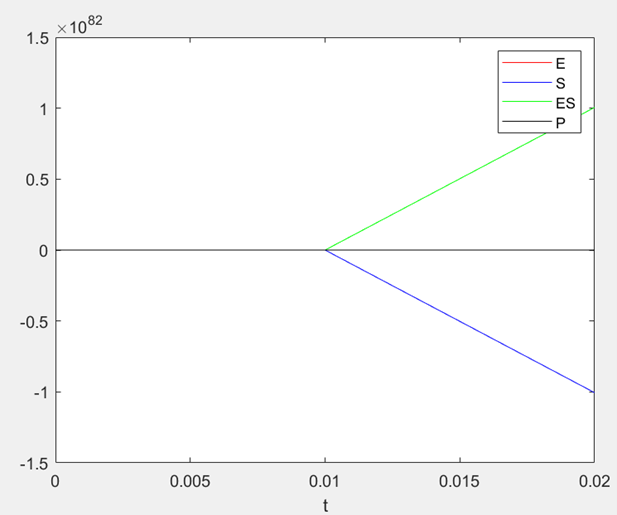
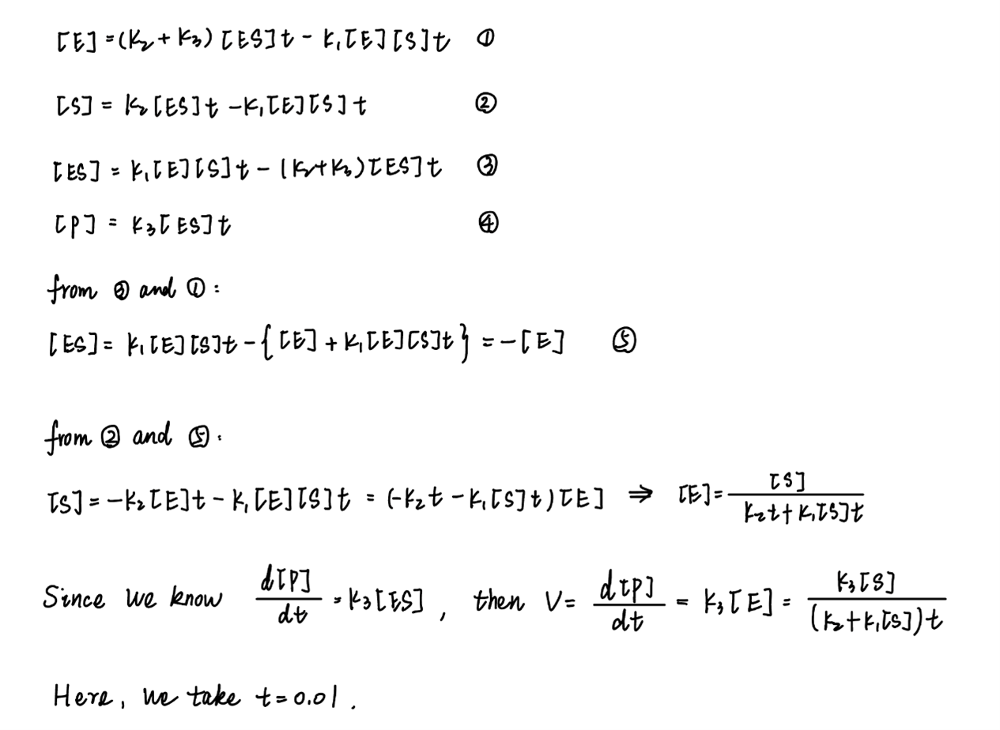
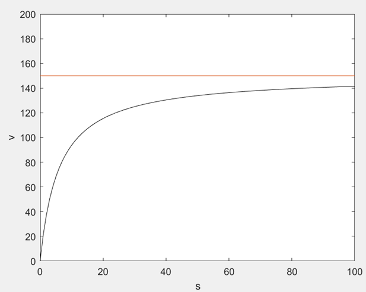
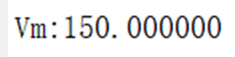

## Question2

``` matlab
clc
clear all
close all
E(1) = 1;
S(1) = 10;
ES(1) = 0;
P(1) = 0;
h=0.01;
a = 0;
b=20;
[E,S,ES,P] = RK(E,S,ES,P,h,a,b);
figure 
plot(a:h:b,E,'r');
hold on
plot(a:h:b,S,'b');
hold on
plot(a:h:b,ES,'g');
hold on
plot(a:h:b,P,'k');
hold off
legend('E','S','ES','P')
xlabel('t')
t = 0.01;
k1 = 100;
k2 = 600;
k3 = 150;
s = 0:100;
v = (k3*s)./(t*(k2+s*k1));
figure
plot(s,v,'k');
hold on
xlabel('s')
ylabel('v')
syms x
f = (150*x)./(0.01*(600+x*100));
fprintf('Vm:%f\n',limit(f,x,inf));
plot(s,150*ones(1,length(s)))
hold off
axis([0,100,0,200]);

function output = f1(t,E,S,ES,P)
k1 = 100;
k2 = 600;
k3 = 150;
output = k2*ES+k3*ES-k1*E*S;
end

function output = f2(t,E,S,ES,P)
k1 = 100;
k2 = 600;
k3 = 150;
output = k2*ES-k1*E*S;
end

function output = f3(t,E,S,ES,P)
k1 = 100;
k2 = 600;
k3 = 150;
output = k1*E*S-k2*ES-k3*ES;
end

function output = f4(t,E,S,ES,P)
k3 = 150;
output = k3*ES;
end

function [u1,u2,w1,w2] = RK(u1,u2,w1,w2,h,a,b)
 
x = a:h:b;
 
for i = 1:length(x)-1
 
k11 = f1(x(i) , u1(i) , u2(i) , w1(i) , w2(i));
k21 = f2(x(i) , u1(i) , u2(i) , w1(i) , w2(i));
k31 = f3(x(i) , u1(i) , u2(i) , w1(i) , w2(i));
k41 = f4(x(i) , u1(i) , u2(i) , w1(i) , w2(i));
 
k12 = f1(x(i)+h/2 , u1(i)+h*k11/2 , u2(i)+h*k21/2 , w1(i)+h*k31/2, w2(i)+h*k41/2);
k22 = f2(x(i)+h/2 , u1(i)+h*k11/2 , u2(i)+h*k21/2 , w1(i)+h*k31/2, w2(i)+h*k41/2);
k32 = f3(x(i)+h/2 , u1(i)+h*k11/2 , u2(i)+h*k21/2 , w1(i)+h*k31/2, w2(i)+h*k41/2);
k42 = f4(x(i)+h/2 , u1(i)+h*k11/2 , u2(i)+h*k21/2 , w1(i)+h*k31/2, w2(i)+h*k41/2);
 
k13 = f1(x(i)+h/2 , u1(i)+h*k12/2 , u2(i)+h*k22/2 , w1(i)+h*k32/2 , w2(i)+h*k42/2);
k23 = f2(x(i)+h/2 , u1(i)+h*k12/2 , u2(i)+h*k22/2 , w1(i)+h*k32/2 , w2(i)+h*k42/2);
k33 = f3(x(i)+h/2 , u1(i)+h*k12/2 , u2(i)+h*k22/2 , w1(i)+h*k32/2 , w2(i)+h*k42/2);
k43 = f4(x(i)+h/2 , u1(i)+h*k12/2 , u2(i)+h*k22/2 , w1(i)+h*k32/2 , w2(i)+h*k42/2);
 
k14 = f1(x(i)+h , u1(i)+h*k13 , u2(i)+h*k23 , w1(i)+h*k33 , w2(i)+h*k43);
k24 = f2(x(i)+h , u1(i)+h*k13 , u2(i)+h*k23 , w1(i)+h*k33 , w2(i)+h*k43);
k34 = f3(x(i)+h , u1(i)+h*k13 , u2(i)+h*k23 , w1(i)+h*k33 , w2(i)+h*k43);
k44 = f4(x(i)+h , u1(i)+h*k13 , u2(i)+h*k23 , w1(i)+h*k33 , w2(i)+h*k43);
 
u1(i+1) = u1(i) + h/6 * (k11 + 2*k12 + 2*k13 + k14);
u2(i+1) = u2(i) + h/6 * (k21 + 2*k22 + 2*k23 + k24);
w1(i+1) = w1(i) + h/6 * (k31 + 2*k32 + 2*k33 + k34);
w2(i+1) = w2(i) + h/6 * (k41 + 2*k42 + 2*k43 + k44);
 
end
end
```


Where E and ES are coincident.
 





 

